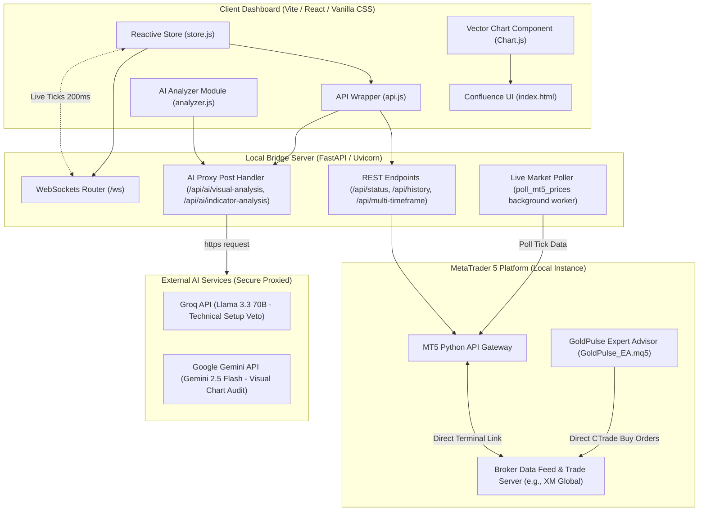

# GoldPulse 📈
### Institutional-Grade XAUUSD Trading Command Center & Algorithmic Execution System

GoldPulse is an elite, high-performance forex trading dashboard and automated execution system tailored exclusively for the **XAUUSD (Gold Spot)** market. Designed with a **Deep Space Slate** theme prioritizing high-contrast visual metrics, it bridges raw market mechanics with cognitive and quantitative frameworks. 

By leveraging a secure **Python FastAPI Local Bridge**, GoldPulse streams live sub-second market data from **MetaTrader 5 (MT5)**, runs a mathematical **Multi-Timeframe Confluence Matrix**, executes a **Long-Only Liquidity Sweep EA**, and audits setups using secure, proxied AI diagnostics powered by **Groq Llama 3.3** and **Google Gemini 2.5 Flash**.

---


---

## 🏛️ System Architecture

GoldPulse is engineered as a three-tier system, separating presentation, secure integration/data polling, and execution.



### 1. Presentation Layer (Vite Frontend Dashboard)
- **Data Engine**: A pure Javascript Pub-Sub reactive store ([store.js](file:///c:/Projects/Projects/Trading%20Stratergy/src/data/store.js)) coordinates state between all widgets.
- **Visual Vector**: High-performance charting canvas ([Chart.js](file:///c:/Projects/Projects/Trading%20Stratergy/src/components/Chart.js)) mapping live market structures.
- **Indicators Engine**: Calculations for EMA, RSI, MACD, and ATR ([indicators.js](file:///c:/Projects/Projects/Trading%20Stratergy/src/engine/indicators.js)).
- **Psychological Journal**: Cognitive tracking dashboard logging trader emotions (FOMO, reactive, confident) alongside risk stats to audit decision fatigue.

### 2. Integration & Security Layer (Python FastAPI Bridge)
- **Direct Terminal Link**: Employs the python `MetaTrader5` API to establish direct communication with the local MT5 terminal.
- **WebSocket Polling Worker**: A concurrent background thread polls live quotes every `200ms` and broadcasts tick packets (Bid/Ask/Spread/Time) via WebSockets to keep UI loads lightweight.
- **Secure AI Proxy**: Intercepts AI calls and proxies requests to **Groq** and **Gemini** using server-side keys. **This prevents API key exposure in client-side production build bundles.**
- **Network Hardening**: Binds strictly to loopback (`127.0.0.1`) preventing unauthorized remote access.

### 3. Execution & Algo Layer (MetaTrader 5 & GoldPulse EA)
- **GoldPulse EA**: An institutional-grade, long-only buy-the-dip algorithmic trade robot ([GoldPulse_EA.mq5](file:///c:/Projects/Projects/Trading%20Stratergy/GoldPulse_EA.mq5)) running natively on the terminal.
- **Identical Confluences**: Executes the exact mathematical and price action checks calculated on the frontend to automate execution.
- **Execution Safeguard**: Limits active trades to a maximum of one open position and automatically maps structural SL and TP targets.

---

## ⚡ Algorithmic Triggers (Tier 1 Setups)

GoldPulse operates on a **Long-Only, Buy-the-Dip / Bottom-Seeking** strategy. It strictly ignores momentum chasing. Triggers require one of these strong structural anomalies:

### 1. Liquidity Sweep
* **Mechanic**: Smart money driving price below historical retail stop-loss clusters to absorb sell orders before reversing.
* **Scan Phase**: Scans the last 40 bars on the **1-Hour (H1) timeframe** to locate structural swing lows.
* **Trigger Phase**: Monitors the **5-Minute (M5) timeframe** for candles whose wicks dip below an active H1 structural level, but whose close recovers back above it.
* **Sanity Gate**: Sweeps deeper than `1.2 ATR` are classified as legitimate bearish breakouts, and are automatically blocked.

### 2. Bullish Fair Value Gap (FVG) Fill
* **Mechanic**: Rapid, high-volume candle expansions that leave structural price imbalances (inefficient delivery of selling liquidity).
* **Scan Phase**: Scans historical M5 bars to find imbalances where:
  $$\text{Low}_{(\text{Bar } i)} > \text{High}_{(\text{Bar } i+2)}$$
* **Trigger Phase**: Confirmed if the current XAUUSD Spot Ask price enters the dynamic top-to-bottom boundaries of this imbalance zone near historical support.

### 3. Breakout Retest Rejection
* **Mechanic**: Price breaking clean through a strong high-timeframe structural resistance level and returning to test it as newly-established support.
* **Scan Phase**: Identifies previous major H1 swing highs that have been broken by a H1 candle close.
* **Trigger Phase**: Executes if M5 candle wicks touch the level within a $\pm 0.5$ pip boundary, followed by an immediate bullish bounce and wick rejection.

---

## 📊 Confluence Matrix (Scoring Engine)

Every market tick is parsed through a multi-timeframe scoring matrix. Technical indicators act as context gates, while price action acts as the execution trigger.

### **Tier 1: Structural Setup Triggers (The Gates)**
*No trade can be entered unless a Tier 1 structural setup is active.* The base score is set to the highest active setup:
- **Liquidity Sweep**: `+3.0`
- **Bullish FVG Fill**: `+2.0`
- **Breakout Retest**: `+2.0`
- **Re-accumulation Range**: `+1.5`
- **Hard Gate**: If Tier 1 Base Score $< 1.5$, Confluence verdict is hard-set to `WAIT`.

### **Tier 2: Confirmations (The Accelerators)**
*Added to the base score if a Tier 1 setup is active:*
- **Institutional Volume Spike**: $\ge 2.0\times$ average of last 20 candles = `+1.5`
- **Elevated Volume Spike**: $\ge 1.5\times$ average of last 20 candles = `+0.75`
- **Candlestick Reversal Pattern**: Bullish Engulfing or Pin Bar/Hammer at structure = `+1.0`
- **RSI Rubber-Band Oversold**: RSI (14) $< 35.0$ at structure = `+1.0`
- **Bullish FVG Alignment**: Setup zone coincides directly with an active FVG zone = `+1.0`
- **Bullish RSI Divergence**: Price makes lower lows while RSI makes higher lows = `+1.0`
- **MACD Shift**: Histogram turning upward below the zero line = `+0.5`
- **Dynamic EMA Bounce**: Price trading inside the EMA 21/50 value pocket = `+0.5`

### **Tier 3: Filters & Penalties (The Brakes)**
*Subtracted from the score, or capping execution to protect capital:*
- **Buying Into Resistance**: Current price is within `0.5 ATR` of H1/D1 Resistance = `-2.0`
- **RSI Overbought Protection**: RSI (14) $> 70.0$ (momentum exhausted) = `-1.5`
- **Heavy Overhead Supply**: Two or more critical resistance levels directly overhead = `-1.0`
- **Daily Bearish Trend Filter**: If the **Daily (D1) structure is Bearish** (EMA 21 < EMA 50), the total confluence score is **capped at 2.0 max**. *This prevents counter-trend trading against the macro daily flow.*

### **Final Scoring Verdict**
- **Score $\ge$ 4.0**: 🟢 **STRONG BUY** (High institutional alignment)
- **Score $\ge$ 2.5**: 🟡 **BUY** (Standard high-probability setup)
- **Score $<$ 2.5**: 🔴 **WAIT** (Insufficient structural confluence)

---

## 🛡️ Capital Preservation Rules

Designed specifically around a **$50 Base Account** configuration to ensure absolute risk mitigation and account longevity:

1. **Risk Ceiling**: Maximum risk per trade is strictly capped at **1% to 2% ($0.50 to $1.00)**.
2. **Micro Lot Sizing**: Standardized strictly at **0.01 lot size**. On XM Ultra Low standard accounts, a 0.01 micro-lot makes XAUUSD pip values equal to exactly $\approx \$0.01$ per pip, fitting small equity profiles.
3. **Take-Profit Target**: Mapped directly to the nearest structural H1 resistance level. If it is too close or doesn't exist, a standard **1:2 Risk-to-Reward ratio** is enforced by projecting a fallback target at $3.0\times \text{ ATR}$ distance.
4. **Stop-Loss Target**: Placed precisely below the trap wick low or structural support, backed by a **$0.5\times \text{ ATR}$ breathing buffer** to avoid premature sweep hunts.
5. **No Correlation Risk**: Strictly limited to **1 active trade at any given time**. Multiple simultaneous positions are locked by the Risk Manager.
6. **Macro Event Lockout**: System automatically gates trade signals during critical high-impact publications (CPI, FOMC, and NFP) to bypass slippage risks.

---

## ⚙️ Installation & Environment Setup

### 1. Environment Configuration
Create a `.env` file in the root directory to store your API keys:
```env
# Secure AI Keys (Configured on the FastAPI Local Bridge Server)
GROQ_API_KEY=your_groq_api_key_here
GEMINI_API_KEY=your_gemini_api_key_here
```
*(Your `.env` file is protected and listed in `.gitignore` to prevent leaks.)*

### 2. Start the Backend Bridge Server (FastAPI)
Open your terminal, navigate to the `server` directory, configure your virtual environment, and run the bridge:
```bash
cd server
python -m venv .venv

# On Windows:
.venv\Scripts\activate
# On Mac/Linux:
source .venv/bin/activate

pip install -r requirements.txt
python mt5_bridge.py
```
*The secure bridge binds to `127.0.0.1:8765` and will auto-initialize/re-connect to your running MT5 Terminal.*

### 3. Start the Frontend Dashboard (Vite)
In a new terminal window, install npm dependencies and launch the server:
```bash
npm install
npm run dev
```
*Vite will compile and launch the dashboard, typically at `http://localhost:5173`.*

### 4. Initialize MT5 Expert Advisor (GoldPulse EA)
1. Launch your **MetaTrader 5 Terminal** (ensure Algo Trading is enabled).
2. Copy `GoldPulse_EA.mq5` into your terminal's data folder under `MQL5/Experts`.
3. Open an active **XAUUSD M5 chart** and attach the `GoldPulse_EA` expert advisor.
4. The EA will calculate technical structural sweep metrics in perfect synchronization with the frontend, ready to execute buy orders.

---

## ⚖️ Disclaimer
GoldPulse is an educational, analytical, and diagnostic dashboard built for informational purposes. It does not constitute financial advice. Foreign exchange and CFDs carry a high level of risk and may result in the loss of your capital.
